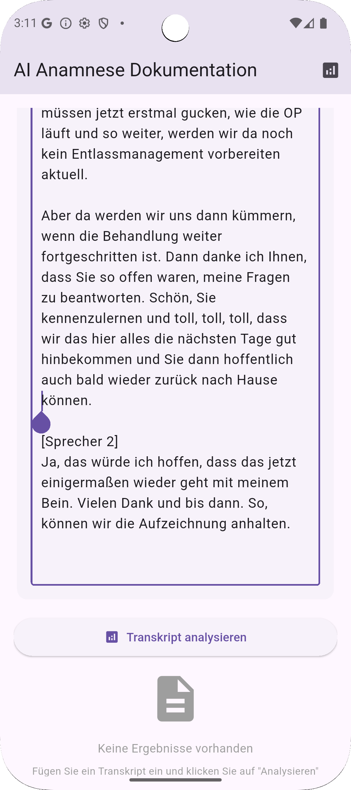

# Anamnesis AI Companion


## 🚀 Project Overview

The **Anamnesis AI Companion** is a robust Flutter-based mobile application designed to streamline the process of patient anamnesis (medical history collection). It leverages **FHIR (Fast Healthcare Interoperability Resources)** compliant questionnaires to ensure standardized data capture and integrates with **OpenAI's powerful AI capabilities** for intelligent processing, analysis, and generation of medical insights from patient responses. The application also supports exporting collected data for further use.

This project focuses on secure data handling, user-friendly interface, and the potential to revolutionize how medical history is gathered and utilized in a modern healthcare context.

## ✨ Features

* **FHIR Compliant Questionnaires:** Utilizes structured JSON questionnaires (e.g., `2025-03-26 NursIT Anamnesis FHIR Questionnaire with detailed descriptions.json`) for standardized and comprehensive data collection.
* **OpenAI Integration:** Connects with OpenAI services (e.g., GPT models) to process anamnesis responses, potentially generating summaries, identifying key concerns, or suggesting follow-up questions.
* **Secure Environment Variables:** Employs `.env` files for secure management of API keys and other sensitive configurations, ensuring they are not committed to version control.
* **CSV Data Export:** Allows for easy export of collected anamnesis data into CSV format, facilitating integration with other systems or for further data analysis.
* **Cross-Platform Compatibility:** Built with Flutter, enabling seamless deployment and consistent user experience across Android, iOS, Web, and Desktop platforms.
* **User-Friendly Interface:** Designed with an intuitive and efficient interface to streamline the data entry process for healthcare professionals.

## 🛠️ Technologies Used

* **Flutter:** The UI toolkit for building natively compiled applications for mobile, web, and desktop from a single codebase.
* **Dart:** The programming language optimized for client-side development.
* **OpenAI API:** For integrating advanced AI models into the application's workflow.
* **FHIR (Fast Healthcare Interoperability Resources):** An industry standard for exchanging healthcare information electronically.
* **JSON:** Used for defining the structured anamnesis questionnaires.
* **CSV:** The format for exporting collected data.

## ⚡ Getting Started

Follow these steps to set up and run the project locally on your development machine.

### Prerequisites

* [Flutter SDK](https://flutter.dev/docs/get-started/install) installed and configured.
* A code editor such as [VS Code](https://code.visualstudio.com/download) or [Android Studio](https://developer.android.com/studio).
* An OpenAI API Key, which you can obtain from the [OpenAI Platform](https://platform.openai.com/).

### Installation

1.  **Clone the repository:**
    Open your terminal (e.g., Git Bash / MINGW64) and clone the project. Remember to replace `your-username` with your actual GitHub username after you create the repository on GitHub.
    ```bash
    git clone [https://github.com/your-username/anamnesis-ai-companion.git](https://github.com/your-username/anamnesis-ai-companion.git)
    cd anamnesis-ai-companion
    ```

2.  **Install Flutter dependencies:**
    Navigate into the cloned project directory and fetch all required Flutter packages.
    ```bash
    flutter pub get
    ```

3.  **Set up Environment Variables:**
    Create a file named `.env` in the **root** of your project (the same directory where `pubspec.yaml` and `README.md` are located).
    Add your OpenAI API key and any other necessary sensitive variables to this file.

    **Example `.env` file content:**
    ```
    OPENAI_API_KEY=sk-your_actual_openai_api_key
    # Add other sensitive variables specific to your application here
    ```
    **Important:** Due to the `.gitignore` setup we completed, the `.env` file **will NOT be committed to your Git repository**, ensuring your sensitive keys remain private.

### Running the Application

1.  **Choose a target device or emulator:**
    List available devices:
    ```bash
    flutter devices
    ```
    Then, select a device ID (e.g., `emulator-5554`) and run the application:
    ```bash
    flutter run -d <device_id>
    ```
    Or, to run on the first available device:
    ```bash
    flutter run
    ```

2.  **For Web (optional):**
    ```bash
    flutter run -d chrome
    ```
    *(You can replace `chrome` with other web browsers if installed.)*

## 📸 App Screenshots & Examples

Here are some visual examples to showcase the application's interface and functionality:

### Anamnesis Data Entry Interface

*A screenshot showing the user interface for entering patient anamnesis data based on the FHIR questionnaire.*

### AI Analysis Result Example

*An example of the intelligent analysis or summary generated by integrating with OpenAI, derived from the collected patient responses.*

### CSV Export Example (csv.jpg)
